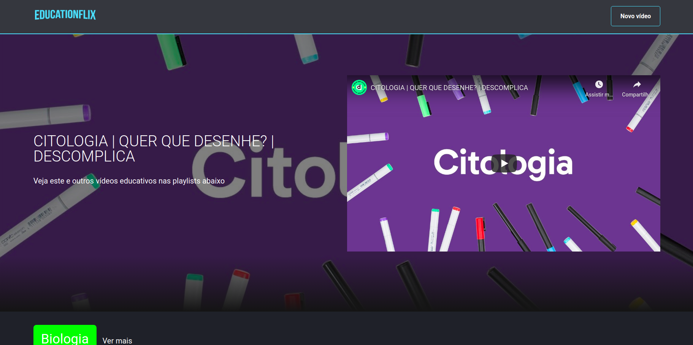

<h1 align="center" >
    
</h1>

<h1 align="center">
    
</h1>

## 💻 Sobre o projeto

Educationflix - É uma plataforma de vídeos inspirado na Netflix que reune diversas playlists de videos educativos dos mais variados temas, onde o usuario pode interagir adicionando novos videos nas categorias presentes, ou pode criar sua propria categoria e compartilhar seus videos preferidos sobre o tema.

## Como rodar o projeto?

```
# Clone este repositório
$ git clone https://github.com/pablwoAraujo/aluraflix

# Acesse a pasta do projeto
$ cd aluraflix

# Instale as dependências
$ npm install

# Execute a aplicação 
$ npm run dev
```

<p align="center">
  
</p>

> Projeto construido durante a [Imersão React da Alura](https://www.alura.com.br/imersao-react/)
